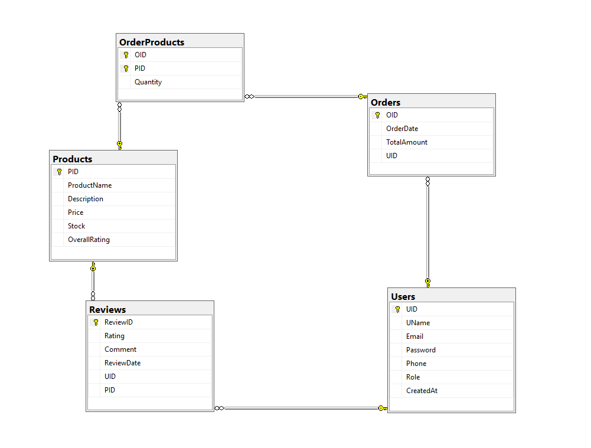

# E-CommerceSystem

A layered **ASP.NET Core Web API** project that provides a backend for managing **users, products, orders, and reviews**.  
It uses **Entity Framework Core** with SQL Server, **JWT authentication** for security, and follows a **clean separation of concerns** with Controllers → Services → Repositories → DbContext.

## Project Structure

### E-CommerceSystem/

- Program.cs -> Startup pipeline, DI, EF Core, JWT, Swagger
    - ApplicationDbContext.cs -> DbContext with DbSets & configs
	- appsettings.json -> Connection string, JwtSettings
- Controllers -> API endpoints 
    - UserController.cs
    - ProductController.cs
    - OrderController.cs
    - ReviewController.cs

- Models -> Entities + DTOs
    - Entities
       - User.cs
       - Product.cs
       - Order.cs
       - OrderProducts.cs   // (Order–Product)
       - Review.cs
    - DTOs
       - UserDTO.cs
       - ProductDTO.cs
       - OrderItemDTO.cs
       - OrdersOutputOTD.cs
       - ReviewDTO.cs

- Repositories   -> Data access 
    - Interfaces
       - IUserRepo.cs
       - IProductRepo.cs
       - IOrderRepo.cs
       - IOrderProductsRepo.cs
       - IReviewRepo.cs
    - Implementations
       - UserRepo.cs
       - ProductRepo.cs
       - OrderRepo.cs
       - OrderProductsRepo.cs
       - ReviewRepo.cs

- Services -> logic layer
    - Interfaces
       - IUserService.cs
       - IProductService.cs
       - IOrderService.cs
       - IReviewService.cs
    -  Implementations
       - UserService.cs
       -  ProductService.cs
       - OrderService.cs
       - ReviewService.cs
       
- Migrations -> Migrations (schema changes)
       - 20241217080107_initialCreate.cs 
       - 20241217082938_UpdateUserEmail.cs 
       - 20241217082956_UpdateUserEmail2.cs
       - 20241218115023_editUserIDColumninOrderTable.cs

- README.md -> Documentation 

---

## Schemas

## [Schema Code](Schema/Schema.sql)

### Entities & Relationships

- User (1) — (many) Order

- User (1) — (many) Review

- Product (1) — (many) Review

- Order (many) — (many) Product via OrderProducts (composite PK of OID,PID)

--- 

## Features

- **Authentication & Authorization**
  - JWT tokens with claims (user id, name, role).
  - Role-based access (`admin` , `user`).

- **User**
  - Register with validation (email, password).
  - Login to receive JWT token.
  - Get User and filtered By ID .
  - Add User .

	
- **Product**
  - Add & update products .
  - Get products and filtered by Id or Name .
	
- **Order**
  - Place orders, reduce stock, calculate totals.
  - Retrieve all orders for the current logged-in user.
	
- **Review**
  - Add reviews.
  - Update/delete only by review owner.

